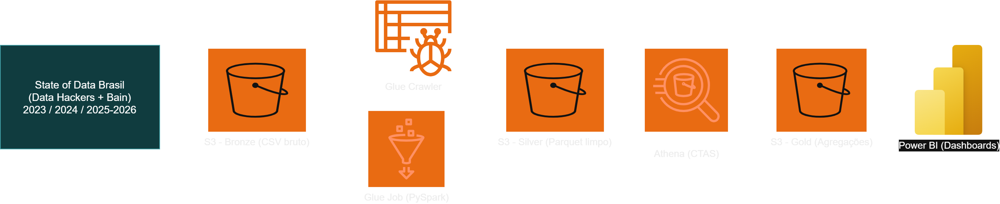

# Tech Challenge Fase 3 — Pipeline de Dados AWS | State of Data Brasil


Pipeline de engenharia de dados em arquitetura medalhão (Bronze → Silver → Gold) construído na AWS, usando a base **State of Data Brasil** (Data Hackers + Bain), anos 2023, 2024 e 2025-2026 — desenvolvido como parte do Tech Challenge da Fase 3 da Pós Tech em Data Analytics (FIAP).

## Sumário

- [O que este projeto faz](#o-que-este-projeto-faz)
- [Arquitetura](#arquitetura)
- [Estrutura do repositório](#estrutura-do-repositório)
- [Resultados e insights de negócio](#resultados-e-insights-de-negócio)
- [Fonte dos dados](#fonte-dos-dados)
- [Ambiente](#ambiente)
- [Integrantes](#integrantes)

## O que este projeto faz

Transforma ~14.000 respostas brutas de pesquisa (3 arquivos CSV, com estruturas de colunas diferentes entre os anos) numa base analítica única e tratada, pronta para consumo em dashboards executivos — respondendo perguntas sobre estrutura do mercado, remuneração, diversidade, adoção de tecnologia e IA generativa no setor de dados no Brasil.

## Arquitetura



| Camada | Serviço AWS | O que acontece |
|---|---|---|
| Ingestão (Bronze) | Amazon S3 | Armazena os 3 CSVs brutos, sem nenhum tratamento |
| Catalogação | AWS Glue Crawler + Data Catalog | Descobre e registra o schema da Bronze |
| Tratamento (Silver) | AWS Glue (PySpark) | Mapeia 421 colunas de negócio entre os 3 anos, remove duplicatas, padroniza tipos |
| Agregação (Gold) | Amazon Athena (CTAS) | Une as 3 Silver e gera 7 tabelas temáticas agregadas |
| Consumo | Power BI | Dashboards executivos a partir da Gold |

## Estrutura do repositório

```
scripts/
  job_02_bronze_para_silver.py   Script Glue (PySpark) — leitura, tratamento e escrita da Silver
  queries_athena_gold.sql        As 7 queries CTAS que geram a camada Gold
docs/
  mapeamento_completo_todas_colunas.csv   De-para das 421 colunas de negócio, entre os 3 anos
diagramas/
  arquitetura.png                Diagrama da arquitetura (feito no Draw.io)
relatorios/
  relatorio_executivo_mercado_dados_ia_v8.pdf   Relatório executivo C-level com os achados de negócio (camada Gold)
```

## Resultados e insights de negócio

A partir da camada Gold, foi produzido um [relatório executivo completo](relatorios/relatorio_executivo_mercado_dados_ia_v8.pdf) com os principais achados do mercado brasileiro de dados (14.001 profissionais, 2023 a 2025/26). Resumo dos indicadores-chave:

| Indicador | Valor |
|---|---|
| Renda mediana nacional | R$ 10.000/mês (faixa modal entre R$ 8k e R$ 12k) |
| Concentração no Sudeste | 62,27% dos profissionais (SP sozinho: 40,74%) |
| Participação feminina | 23,5% do total, caindo para 9,28% no topo salarial (> R$ 40k) |
| Prioridade em IA generativa | 78% das empresas (780+ com orçamento ativo) |

**Principais achados:**

- **Estrutura do mercado**: liderado pelo trio Analista de Dados (24,21%), Cientista de Dados (17,67%) e Engenheiro de Dados (17,44%); 82% dos profissionais têm graduação completa ou pós-graduação.
- **Remuneração e senioridade**: cargos como Data Product Manager (74,74% sênior+) e ML/AI Engineer (54,93% sênior+) concentram as maiores exigências de senioridade e remuneração.
- **Diversidade de gênero**: funil nítido — a presença feminina cai de 28,25% no nível júnior para 20,06% em especialista/staff+ e 9,28% no topo salarial.
- **Stack tecnológico**: AWS lidera como cloud preferida (42-44%), mas o Google Cloud (GCP) cresce até liderar no nível especialista/staff+ (42,99%). Python domina até o nível sênior; SQL vira a linguagem primária no staff+.
- **Adoção de IA**: uso majoritário de soluções gratuitas ou Copilots no dia a dia; as duas maiores barreiras corporativas são dados não preparados (data readiness) e falta de casos de uso de negócio claros.
- **Geografia e modelo de trabalho**: São Paulo concentra 40,74% da força de trabalho; a exigência de trabalho 100% presencial é apontada como principal causa de troca de emprego, reforçando a demanda por remoto/híbrido.

**Recomendações estratégicas** (síntese do relatório executivo do projeto):

1. Priorizar governança e *data readiness* antes de expandir iniciativas de IA generativa.
2. Focar em casos de uso com ROI claro e alfabetização analítica (*data literacy*) para gestores de negócio.
3. Investir em equidade de gênero e flexibilidade de trabalho como estratégia de retenção de talentos.

## Fonte dos dados

Os dados brutos usados neste projeto (pesquisa **State of Data Brasil**, por Data Hackers + Bain & Company) **não estão incluídos neste repositório** — são de uso público mas com termos próprios de licenciamento no Kaggle. Para reproduzir o pipeline, baixe os 3 datasets originais diretamente no Kaggle (busque por "State of Data Brazil" + o ano correspondente) e ajuste os caminhos de bucket S3 nos scripts.

## Ambiente

Este projeto foi desenvolvido e executado num ambiente **AWS Academy Learner Lab**. Os nomes de bucket nos scripts foram generalizados (`<seu-bucket-s3>`) para publicação — substitua pelo seu próprio bucket ao reproduzir.

## Integrantes

- Keisy Amorim Moreira Magalhães
- Luiz Cesar dos Santos
- Arthur da Silva Barbosa Lima
- Renato de Oliveira Naddeo
- Bruna Rodrigues Andrade
